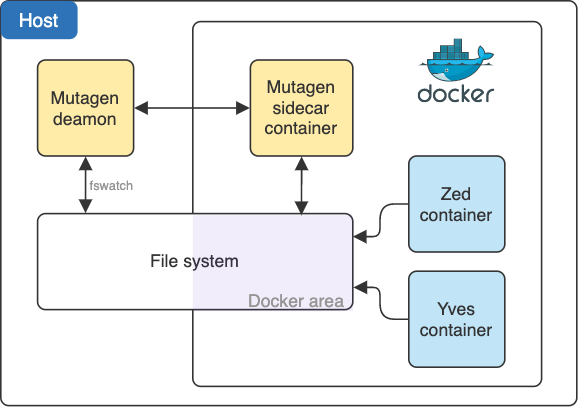

This document is a draft. See [Docker SDK](https://documentation.spryker.com/docs/docker-sdk) for official documentation.

## Description
Read the description below and, in the *Structure* section, fill out the document by answering the questions directly.

> Audience:
>
> - Developers who are developing with docker/sdk.
>
> Outcome:
> - You know how to choose a mount mode based on a platform.
> - You understand the specifics of synchronization file mode.

## Outline

1. Short description of every mount mode docker/sdk support.
2. How sync modes work and what their downsides are. Figure: https://spryker.atlassian.net/wiki/spaces/PS/pages/1098088730/Mounting+for+development+in+MacOS+Windows

### Important points to cover

* Description of mount modes should include information on what mode is preferable for what actions and what platform.
* Provide links to the official docs of Docker Desktop and GitHub where file sharing is described.

## Structure

:::(Info)(Structure)
The structure below is just a reference. We encourage you to add subsections, change or swap the provided sections if needed.
:::

### Selecting a mount mode for development

Depending on your operating system (OS), choose one of the mount options in the table.

| Mount option |        MacOS            | Linux              | Windows (WSL1)          | Windows (WSL2)     |
|--------------|-------------------------|--------------------|-------------------------|--------------------|
| native       | :ballot_box_with_check: | :heavy_check_mark: | :ballot_box_with_check: | :heavy_check_mark: |
| mutagen      | :heavy_check_mark:      |                    |                         |                    |
| docker-sync  | :white_check_mark:      |                    | :heavy_check_mark:      |                    |

* (:heavy_check_mark:) - recommended solution
* (:white_check_mark:) - supported solution
* (:ballot_box_with_check:) - supported solution with very slow performance

### Supported mount modes

docker/sdk supports the following mount modes:

* `baked`
Copies source files into image, so they *cannot* be changed from host machine.
The file or directory is referenced by its absolute path on the host machine.
This mount option is default for the Demo mode.

* `native`
Mounts source files directly from host machine into containers.
Works perfectly with Linux and Windows (WSL2).

* `docker-sync`
Synchronizes source files from host machine into running containers.
This mount option is stable with MacOS and Windows (WSL1).

* `mutagen`
Synchronizes source files between your host machine and a container in an effective real-time way that combines the performance of the rsync algorithm with bidirectionality and low-latency filesystem watching.
This mount option is stable with MacOS.

### Changing a mount mode for development

To set a mount mode define your OS for the desired mount mode in `deploy.dev.yml`:

```yaml
docker:

...

    mount:
        native:
            platforms:
                - linux

        docker-sync:
            platforms:
                - windows

        mutagen:
            platforms:
                - macos
```

:::(Info)(Multiple mount modes)
If the same OS is defined for multiple mount modes, the first mount mode matching the OS in descending order is selected.
:::

### Configuring a mount mode

To configure a mount mode, see [Mount modes configuration](07-mount-modes-configuration.md).

### Synchronisation mode and its features

File synchronization tools, such as Mutagen.io or docker-sync, use some algorithms to synchronise your code between host machine and a docker volume. That allows you to run your application at full speed avoiding file system mount latency.



- A daemon listens to the host file system changes
- A sidecar container listens to the VM file system changes.
- The Daemon and the sidecar interact with each other and updates files on each side.
- The applications work with the docker volume directly that is almost equal to direct file system access.

#### What should I keep in my mind using a synchronisation mode?
* A few seconds delay when I change one or several files.
* It could take a while when I perform massive file operations, like `git checkout` or `composer install` I should wait for synchronization by looking on the synchronization status.
* I can use `docker/sdk sync logs` that shows the current status of the synchronisation session. It works for `docker-sync` and `mutagen`.
* I should use `docker/sdk down` to terminate my synchronization session when I finish my work.

### See also

* [Manage data in Docker](https://docs.docker.com/storage/)
* [Mutagen documentation](https://mutagen.io/documentation/introduction)
* [Docker-sync documentation](https://docker-sync.readthedocs.io/)
